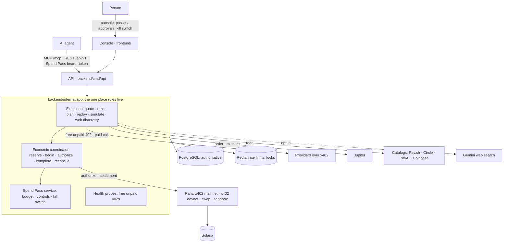

# Architecture

Algebra is the router and spend firewall for AI agents that pay for APIs on Solana. An agent asks for an outcome and a ceiling; Algebra finds the providers, prices them, picks
one, pays it from a wallet the agent never sees, checks the answer and signs a receipt, inside limits a person set. This page is how the pieces fit; the layer-by-layer detail
is in [EXECUTION.md](EXECUTION.md) (routing, rails, catalogs) and [ECONOMIC_COORDINATION.md](ECONOMIC_COORDINATION.md) (why money moves at most once).

## 1. System context



MCP, REST and the console are **thin transports**: they parse a request, resolve who is calling, call one application service and serialize the answer. No rule is duplicated across
transports (`backend/internal/api/v1`, `backend/internal/mcpserver`, and `frontend/` which talks only to the REST API). The MCP server is mounted on the API process at `/mcp`, built from the same
`wiring.Bundle` as the REST handlers.

## 2. One request

```mermaid
sequenceDiagram
    participant A as Agent
    participant X as ExecutionService
    participant P as SpendPass / policy
    participant C as Coordinator
    participant R as Rail
    participant V as Provider
    A->>X: execute(capability, input, ceiling, strategy)
    X->>C: create or find the intent (deterministic effect key)
    alt already committed
        X-->>A: the kept answer, replayed:true (nothing paid)
    end
    X->>P: screen candidates against the pass (nobody is asked anything yet)
    X->>V: free unpaid 402 to each candidate, all at once (1.5 s grace after the first price)
    X->>X: guards, limits, Rank(cheapest | fastest | auto) → plan
    X->>C: reserve (one live attempt per intent) → begin (pass re-checked)
    X->>R: authorize payment (kill switch re-checked; the wallet signs; the agent never sees a key)
    X->>V: the call, with payment
    V-->>X: the answer
    X->>X: verify (schema, quality), keep sealed, hash
    X->>C: complete(report)
    C->>R: settlement(evidence): from chain state, never from anyone's word
    C-->>X: COMMITTED + signed receipt (or UNKNOWN → reconcile; never a second payment)
    X-->>A: the answer, routing explanation, receipt
```

If the first provider fails before any money moves the coordinator reopens the intent and the next step in the plan runs. If the outcome is ambiguous, no other attempt may run until the rail proves
what happened.

## 3. Where state lives

PostgreSQL is authoritative; the invariants that matter are enforced by the database, not by application memory.

| Table | What |
|---|---|
| `economic_intents`, `economic_reservations`, `economic_events`, `economic_receipts` | The outcome, each attempt at it (at most one live, at most one committed), an append-only event log, the signed receipt. |
| `spend_passes` | Budget, caps, approval line, allowed providers, controls (velocity, new-provider rule), frozen/revoked. |
| `route_executions` | What each attempt did (cost, latency, quality): what the router learns from. |
| `provider_health` | What the free probe last found. |
| `intent_results` | The answer kept for replay: sealed (AES-256-GCM), expiring, bound to its intent, person and reservation. |
| `users`, `user_sessions`, `agents`, … | Accounts, human sessions (HttpOnly cookie, hashed at rest) and agent identities (a bearer token, hashed). |

Redis only rate limits and takes short locks, and the API runs without it locally. Nothing in Redis is a correctness guarantee.

## 4. Trust boundaries

1. **Person ↔ agent.** An agent spends under its own Spend Pass and can never approve its own spending; human-only endpoints (approvals, passes, kill switch, `/me`) accept only a session cookie.
2. **Agent ↔ Algebra.** A scoped, revocable bearer token resolved to an identity on every call; every intent-scoped call checks the intent belongs to the caller.
3. **Algebra ↔ providers.** Providers are untrusted: reached only at public addresses (checked on the dialled IP), never redirected with a payment, their text is data, their price is a claim to verify, their answer is labelled untrusted.
4. **Algebra ↔ rails.** The wallet's key never leaves the rail. Each rail has hard ceilings of its own, signs only what it has checked, and proves settlement from chain state.
5. **Algebra ↔ catalogs and the open web.** A listing is not an endorsement; a model's output is trusted for nothing but an address, which is then probed.

The threat model, with the mitigation for each and what is not yet covered, is [THREAT_MODEL.md](THREAT_MODEL.md).

## 5. Module boundaries (Go modular monolith)

```
backend/             one Go module: a modular monolith
  internal/domain      entities and rules, zero I/O: econ (intents, reservations, evidence), routing (candidates, quotes,
                       ranking, classes, plans, results), spendpass, chain (networks and assets), receipt, account
  internal/app         application services: the one place business rules live
  internal/platform    postgres, redis, solana (RPC, transactions, simulation), safehttp, config, logging, wiring
  internal/api/v1      REST transport (thin)         internal/mcpserver   MCP transport (thin)
  providers/           x402client (runner), solanax402 (rail), paychan (payment channels), jupiter (swaps), catalog, paysh,
                       bazaar (Circle, PayAI, Coinbase), webdiscovery, sandboxpay
  policy/              a public package: the deterministic rule engine, go-gettable by third parties
  cmd/                 api, mcp, demo-provider, solana-wallet, x402-dryrun, verify-intent
frontend/            the console and the agent chat (Next.js); talks only to the REST API
```

`backend/internal/app` depends on interfaces from `backend/internal/domain` and on small interfaces it defines itself (`StepRunner`, `Rail`, `CatalogSource`, `WebFinder`, `ClassSource`), never on a concrete
provider: those are injected by `backend/internal/platform/wiring`. That is what makes a new rail, catalog or execution type an addition rather than a change: Jupiter was added as a runner and a
rail without touching the coordinator.

## 6. Deployment shape

One Go API process (REST, MCP, the sandbox provider) in front of PostgreSQL and optionally Redis; the web app behind an HTTPS load balancer proxies `/api/v1` and `/mcp` to it, so the browser only
ever talks to its own origin. Migrations run when the API starts. Probes: `/healthz`, `/readyz`. See [PRODUCTION.md](PRODUCTION.md) and [GCP_DEPLOYMENT.md](GCP_DEPLOYMENT.md) (a target mapping,
not a claim of an existing deployment).

## 7. The original product

The grocery shopping agent (`PurchaseIntent`, merchant connectors, the card-vault interface) and the tenant payment intents (`AgenticPaymentIntent`, policy sets, webhooks) are still in the tree,
share the same policy, approval and audit infrastructure, and still build and pass their tests. They are described in [legacy/](legacy/README.md). Their state machines and flows are in
[legacy/BUILD_PLAN.md](legacy/BUILD_PLAN.md) and [legacy/B2B_INTEGRATION.md](legacy/B2B_INTEGRATION.md).
